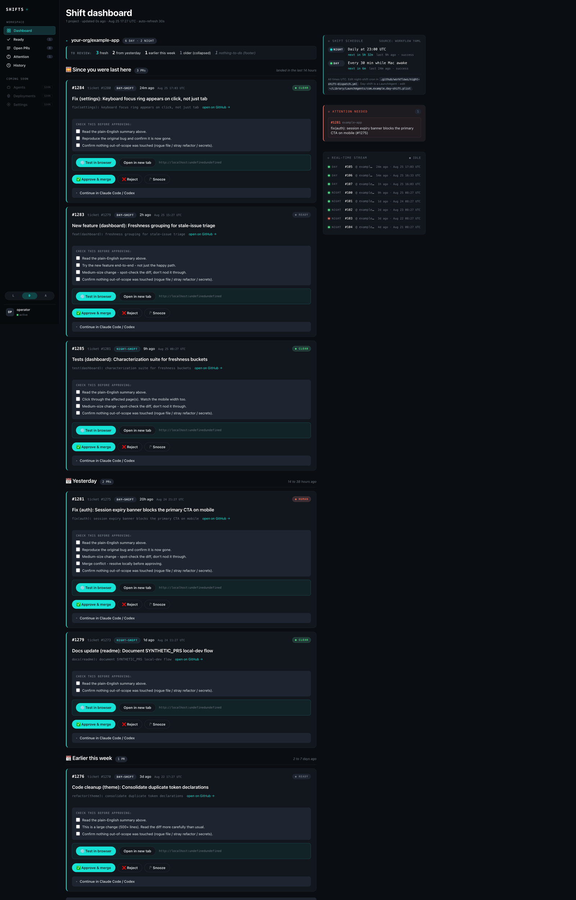
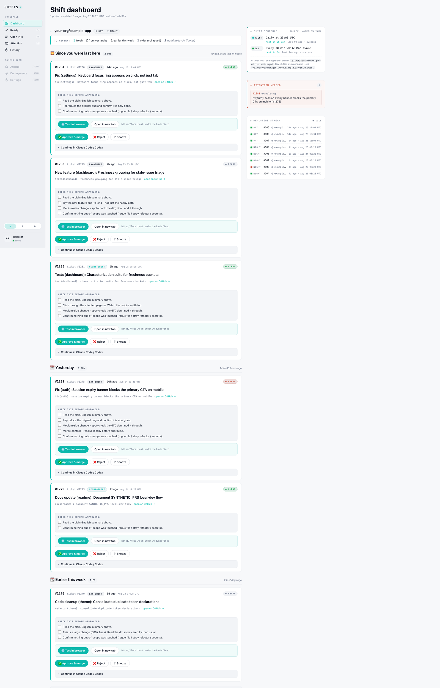
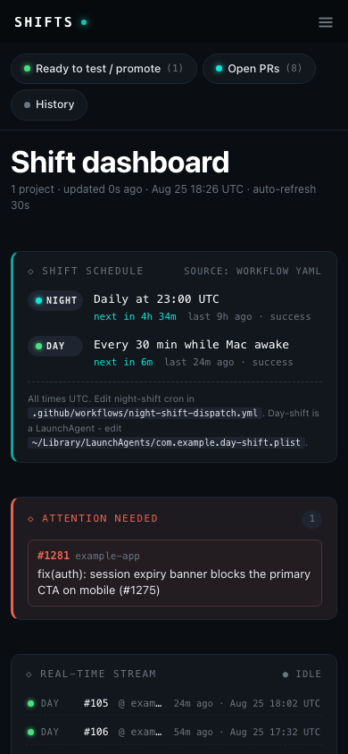

# shift-dashboard

[](https://github.com/Godslove-BA/shift-dashboard/actions/workflows/test.yml)

A CSP-clean dashboard for triaging pull requests opened by autonomous AI agents overnight.



## The problem

Overnight, autonomous coding agents ship pull requests against holding branches while the maintainer sleeps.
By morning there are anywhere from three to twenty of them, each with a different verdict:
one is genuinely ready to merge, three need a human eye, two are no-ops the shift shouldn't have opened, one is stuck on a merge conflict, and the rest are old and stale.

The person doing the triage has a fifteen-minute window before the day starts.
They need to know, in one screen, what landed since they were last here — not what got opened three days ago and is still hanging around.

GitHub's built-in PR list drowns that signal.
It sorts by "recently updated," it treats a five-line rename and a five-hundred-line refactor identically, and it demands you click into each PR to see whether the diff is actually clean.
So the triage becomes a twenty-minute archaeology session and the morning is over before the day starts.

This dashboard replaces that surface.
One HTML page, no JavaScript at runtime, freshness grouping instead of a flat list, a plain-English summary above every engineer-title, one primary CTA per card (Test in browser), and Approve / Reject / Snooze buttons the maintainer can hit from the dashboard without opening GitHub.

## The design



Every design choice in the dashboard traces back to one of five principles:

- **Freshness beats file-count for triage.** The four buckets — `Since you were last here` (14h), `Yesterday` (38h), `Earlier this week` (7d), `Older` (collapsed by default) — tell the reviewer whether a PR is a live concern or archaeology *before* they read the title.
- **The 5th-grader test.** If a junior dev in their first fortnight can't tell what a card is asking them to do at a glance, the card is wrong. Every card leads with a plain-English summary at 17px, with the engineer title in muted 12px mono below it for auditability.
- **Native HTML first.** Server-rendered HTML with a `default-src 'none'` CSP, zero JavaScript at runtime, native `<details>` for disclosure, native `<form>` for actions. The page loads and works with JavaScript disabled.
- **Actions live where the eyes are.** Test in browser, Approve, Reject, Snooze — all rendered on the card, not one click away in a foldout. Each mutation is gated by an in-form typed confirmation so a stray click cannot fire.
- **Accessibility and craft as one thing.** WCAG-AA contrast in both themes. Focus rings on every interactive element. Tap targets above 40px. Freshness sections use real headings so screen readers can jump between them.

Design system details, tokens, component inventory, and the state grammar all live in [DESIGN.md](./DESIGN.md).



## Iteration story

The dashboard shipped in five versions across a week and a half.
Each version was driven by a specific pain the previous version created — not by a redesign for its own sake.

- **v4** — replaced the flat KPI grid with a dense expandable-row PR table. Ticket-grouping collapsed duplicate attempts.
- **v5** — added a Shift Schedule panel to the top of the rail. Answered "when will the next thing fire?" without reading YAML.
- **v6** — theme toggle (dark / light / auto). Server-rendered via URL param + cookie so it works with CSP `script-src 'none'`.
- **v7** — the 5th-grader-test rework. Freshness buckets replaced the flat table. Every card leads with plain English. Approve / Reject / Snooze mutations moved onto the dashboard. No-op PRs collapsed to a footer so they never sit next to real work.
- **v7.1** — hardened the mutation path (form-action CSP, in-form typed confirmation, flash-cookie round-trip). Fixed the branch-name shell-injection surface on the promote recipe.

The full log with dates, diffs, screenshots, and rationale lives in [CHANGELOG.md](./CHANGELOG.md).

## Try it locally

The dashboard normally runs against real repositories via a GitHub PAT.
For local dev, screenshots, and CI-preview builds, `SYNTHETIC_PRS=1` short-circuits every GitHub call and returns a stable fixture — a set of six realistic PRs spanning every freshness bucket, plus a needs-human PR, a no-op PR, and a recently-merged PR.

```bash
cd tools/shift-dashboard
npx wrangler dev
# In a second terminal:
SYNTHETIC_PRS=1 DASHBOARD_SECRET=devkey npx wrangler dev
# Open http://localhost:8787/?key=devkey
```

No GitHub token needed. The dashboard renders end-to-end against the fixture.
To hit real GitHub, set `GH_TOKEN` alongside `DASHBOARD_SECRET` and omit `SYNTHETIC_PRS`; see `tools/shift-dashboard/README.md` for the full first-time setup.

## Stack

- Cloudflare Workers (edge runtime).
- Native HTML and CSS, server-rendered.
- `Content-Security-Policy: default-src 'none'; style-src 'unsafe-inline'; img-src data:; form-action 'self'`.
- Zero JavaScript at runtime. Zero external assets. No CDN, no fonts, no analytics.
- Testing: `node:test` — 206 tests, no test framework dependency.

## Why native HTML? Why no framework?

Framework-free was not an aesthetic choice; it was forced by the environment and then embraced as a discipline.

The dashboard runs on Cloudflare Workers with a strict `default-src 'none'` CSP.
That eliminates every inline script, every CDN-hosted font, every third-party analytics beacon, and every framework runtime that bootstraps in the browser.
Anything the page needs has to be in the HTML the Worker serves — no `<script src>`, no `import()`, nothing.

In return we get: a page that renders on any browser back to 2018, a `View Source` that shows the actual authored HTML (not a hydrated minified blob), a print-legible page (screenshot below), 200-millisecond time-to-interactive on cellular, and a security surface small enough to reason about in one file.
The JavaScript that would normally handle theme switching lives instead in a URL parameter and a cookie the Worker reads server-side; the JavaScript that would normally handle mutation confirmations is a `<input required pattern="APPROVE">` the browser validates natively.

That discipline shows up in the code, too.
`worker.js` is 3,900 lines of one file, all server-rendered strings, tested by 206 unit tests that never touch a browser.
Adding a new feature means adding a new pure function, wiring it into the render, and writing tests against its output.
No build step, no bundler, no framework upgrade to schedule.

If the dashboard grew into a multi-tenant SaaS with settings and preferences, that constraint would need to relax.
For a triage surface used by one person for fifteen minutes a day, the constraint is exactly the right size.

## Related tools in this repo

The dashboard sits on top of a small stack of adjacent tools that make the autonomous overnight flow work.
They are shipped here because the dashboard's design assumptions (holding branches, `TEST_ROUTE:` markers in PR bodies, Agent Brain snapshots, `no code changes` no-op detection) depend on the shifts opening PRs in those shapes.

- **[tools/day-shift](./tools/day-shift/)** — the daytime autonomous ticket picker. A macOS LaunchAgent runs a dispatcher every 30 minutes; the dispatcher picks safe tickets off a GitHub queue, spawns a headless `claude -p` worker per ticket in a dedicated worktree, and opens a draft PR against `day-shift-staging-<date>`.
- **[tools/night-shift](./tools/night-shift/)** — the overnight equivalent, run as a GitHub Action. A director coordinates up to two parallel worker agents and a review agent through the ticket queue; the review agent's verdict drives auto-merge into `night-shift-staging-<date>` (or escalation to morning).
- **[tools/agent-brain](./tools/agent-brain/)** — per-ticket JSON state that persists across iterations. Read/write from both shifts. The dashboard parses the brain snapshot embedded in each PR body to show what the worker tried and where it got to.
- **[tools/fix-video-evidence](./tools/fix-video-evidence/)** — a Claude Code skill that records two short videos of a bug-fix cycle (broken state on the pre-fix commit, working state after) and attaches them to the PR. Uses Playwright's built-in `recordVideo`; portable mode saves a `.webm` a reviewer drags onto the PR comment box (GitHub renders it inline), or opt into R2 auto-upload via env vars. The dashboard shows *what needs review*; this skill provides *proof the fix works*.

The shift orchestration is deliberately not the point of this repo.
The dashboard is the deliverable; the shifts exist to give it something to display.

## Contributing

Design critiques are as welcome as code PRs.
There is a dedicated `design-feedback` issue template — please use it for questions about composition, hierarchy, typography, color, contrast, or accessibility, and expect a real reply.

The one hard invariant is CSP-cleanliness: any change that adds inline JavaScript or a runtime dependency will not land.

## License

MIT — see [LICENSE](./LICENSE).
